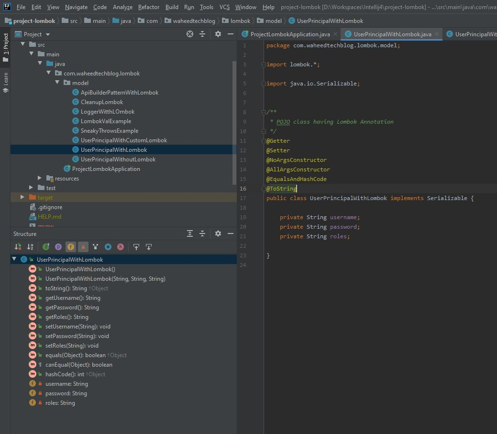
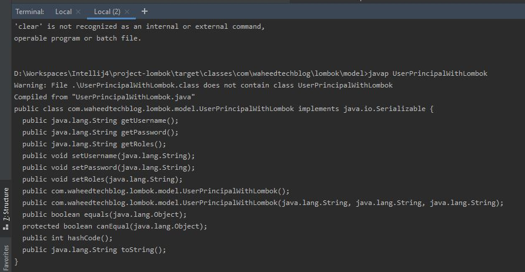

Introduction to Project Lombok
============================================
Copyright (c) 2020, [WaheedTechblog](http://www.waheedtechblog.com/).

Contributor: Abdul Waheed [abdulwaheed18@gmail.com]

[https://github.com/abdulwaheed18/project-lombok](https://github.com/abdulwaheed18/project-lombok)

**Project lombok** tutorial will cover below annotations.

- @Getter @Setter @NoArgsConstructor @AllArgsConstructor @EqualsAndHashCode @ToString
- @Val
- @SneakyThrows
- @Builder
- @Slf4j
- @Cleanup

### Generated Source Code
You can check the genertaed souce code in IntelliJ under Structure tab by just adding Lombok annotation.

Another Way is to check generated .class file using javap command

## Lombok Configuration in Eclipse/IntelliJ Idea
Please read my [blog](https://www.waheedtechblog.com/2020/01/setting-up-lombok-with-springtoolsuite.html) for lombok IDE configuration.
